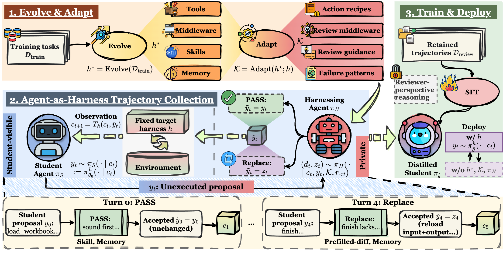

<div align="center">

# Harness-Zero: Harness Distillation via Agent-as-Harness

**Distill an optimized agent harness into model weights — deploy with a minimal harness, keep the gains.**

[](<assets/Harness-Zero Harness Distillation via Agent-as-Harness.pdf>) [](LICENSE) [](https://huggingface.co/metaevo-ai) [](pyproject.toml)

</div>

<p align="center">
  
</p>

Agent harnesses — the external systems that mediate model–environment interaction — can substantially improve agent performance, but their gains remain tied to the harness at deployment. **Harness-Zero** transfers the behaviors an optimized harness induces into the model itself: a *harnessing agent* reviews the student's every response during training-time rollouts and rewrites it, in the student's own action space, whenever the optimized harness would have done better. Fine-tuning on the reviewed trajectories internalizes the behavior — at deployment the harness is gone and the gains remain.

## Highlights

- 📈 **+21.0 points macro-average** on the base model (23.3% → 44.3%) across three domains — a 90.1% relative improvement.
- 🏆 The distilled model **under the minimal harness alone (44.3%) beats the base model with the optimized harness still attached (41.7%)**.
- 🔁 **Agent-as-harness > code-as-harness**: the same evolved harness applied through a harnessing agent averages 81.1% vs. 78.1% for direct mounting on frontier models.
- 🧠 **82.3% recovery** of 28 harness-exclusive behavior patterns (memory, skill, tool, middleware) — direct evidence the behavior moved into the weights.

## Results

Distillation into Qwen3.5-9B:

| Setting | SpreadsheetBench | AppWorld | USPTO | **Avg.** |
|---|---|---|---|---|
| mini-SWE-agent (target harness *h*) | 31.0 | 26.8 | 12.0 | 23.3 |
| meta-harness (evolved harness *h\**) | 39.0 | 48.2 | **38.0** | 41.7 |
| DeepAgents | 35.0 | 19.6 | 7.0 | 20.5 |
| Claude Code | 31.0 | 10.7 | 6.0 | 15.9 |
| **Harness-Zero (distilled, *h* only)** | **44.0** | **58.9** | 30.0 | **44.3** |

## How it works

1. **Evolve & Adapt.** A student-side harness *h\** (tools, middleware, skills, memory —
   the DeepAgents abstraction) is evolved on training tasks, then adapted into a private reference harness *K* (action recipes, review middleware, review guidance, failure patterns) for the harnessing agent. See `harness_bank/` for the evolved harnesses and `.agents/skills/` for the evolution skill.
2. **Agent-as-harness trajectory collection.** The student runs under a fixed, minimal
   mini-SWE-agent-style target harness *h* (one bash tool, fixed system prompt). Before any response is executed, the harnessing agent reviews it using *K* and either **PASS**es it unchanged or **REPLACE**s it with a complete response valid under *h*. Only the accepted response enters the student-visible trajectory; the review stays private.
3. **Train & deploy.** SFT on the reviewed trajectories (masking any reviewer-perspective
   reasoning). The distilled student deploys under *h* alone — no *h\**, no *K*, no harnessing agent.

## Installation

```bash
git clone git@github.com:metaevo-ai/harness-zero.git && cd harness-zero
uv sync                      # rollout + evaluation
uv sync --group tinker       # additionally: training (Tinker recipe)
```

Requirements: Python 3.12–3.13, Docker (rollouts run in local Docker sandboxes via [Harbor](https://github.com/harbor-framework/harbor)).

**Environment variables.** Copy `.env.example` to `.env` and fill in the routes you use — rollouts read this file via Harbor's `--env-file`. Which keys you need depends on the model route: official OpenAI (`OPENAI_API_KEY`), Azure AI Foundry (`AZURE_OPENAI_API_KEY` + `AZURE_OPENAI_ENDPOINT`), OpenRouter (`OPENROUTER_API_KEY`), and Tinker training (`TM_API_KEY`).

## Quickstart

**1. Run a reviewed rollout** (launches Harbor directly; Docker sandboxes):

```bash
printf 'uspto-train-000\nuspto-train-001\n' > /tmp/tasks.txt

harness-zero run-rollout \
  --dataset data/uspto \
  --components harness_bank/uspto \
  --teacher-middleware-factory harness_bank.uspto.middlewares:build_teacher_middlewares \
  --tasks-file /tmp/tasks.txt \
  --attempts 1 --concurrency 8 \
  --student-model openai:<student-model> --student-reasoning-effort high \
  --teacher-provider openai --teacher-model <harnessing-model> --teacher-reasoning-effort high \
  --job-name demo --output-dir runs
```

**2. Build the SFT dataset** from successful reviewed trials:

```bash
harness-zero build-sft --trials runs/demo --output sft.jsonl --reward-threshold 1.0
```

**3. Train** (LoRA SFT via Tinker; asks for confirmation before submitting, `--yes` skips the prompt):

```bash
harness-zero train-sft --data sft.jsonl --base-model Qwen/Qwen3.5-9B \
  --renderer qwen3_5 --rank 32 --peak-learning-rate 2e-4 --final-learning-rate 1e-6 \
  --warmup-ratio 0.05 --epochs 2 --batch-size 8 --max-length 65536 --seed 42 \
  --run-name hz-demo --output-dir runs/train
```

AppWorld rollouts **must** use the dedicated mini-SWE-agent and environment — see [`envs/appworld/README.md`](envs/appworld/README.md).

## Repository layout

```
src/harness_zero/      core method: review schema, harnessing agent, student wrapper,
                       trajectory store, SFT datum builder, Tinker training loop, CLI
src/deepagents_harbor/ Harbor sandbox backend + shared message/reasoning parsing
harness_bank/          per-domain harnesses: evolved student-side h* (*_student) and the
                       adapted reference harness K for the harnessing agent
envs/appworld/         dedicated AppWorld agent/environment + image build + SFT pipeline
data/                  the three Harbor benchmark task sets, exactly as used in the paper
.agents/skills/        the skill used to evolve the student-side harnesses
assets/                figures used in this README
tests/                 local test suite:  PYTHONPATH=src pytest -q
```

## Benchmarks

| Benchmark | Train | Test | Metric |
|---|---|---|---|
| SpreadsheetBench Verified | 300 | 100 | pass@1 |
| AppWorld (`test_normal`) | 147 | 168 (56 scenarios) | SGC |
| USPTO retrosynthesis | 500 | 100 | pass@1 |

All task sets ship in [`data/`](data/README.md) and run under Harbor in Docker.

## Models

Distilled checkpoints (Qwen3.5-9B base, LoRA SFT on reviewed trajectories):

- 🤗 [`metaevo-ai/ahd-9b-ssb`](https://huggingface.co/metaevo-ai/ahd-9b-ssb) — SpreadsheetBench
- 🤗 [`metaevo-ai/ahd-9b-appworld`](https://huggingface.co/metaevo-ai/ahd-9b-appworld) — AppWorld
- 🤗 [`metaevo-ai/ahd-9b-uspto`](https://huggingface.co/metaevo-ai/ahd-9b-uspto) — USPTO

## Citation

Paper: [Harness-Zero: Harness Distillation via Agent-as-Harness](assets/Harness-Zero%20Harness%20Distillation%20via%20Agent-as-Harness.pdf)

```bibtex
@article{ye2026harnesszero,
  title  = {Harness-Zero: Harness Distillation via Agent-as-Harness},
  author = {Ye, Haoran and Lu, Yuxing and Dong, Haonan and Su, Zhaochen and Song, Guojie},
  year   = {2026}
}
```

## License & acknowledgments

Apache-2.0 (see [LICENSE](LICENSE)). `src/deepagents_harbor/.local_deps/` vendors a frozen copy of [deepagents](https://github.com/langchain-ai/deepagents) (MIT, LangChain Inc.). `envs/appworld/prompts/upstream/` contains material from [AppWorld](https://github.com/StonyBrookNLP/appworld); see the bundled license and `provenance.json`.
